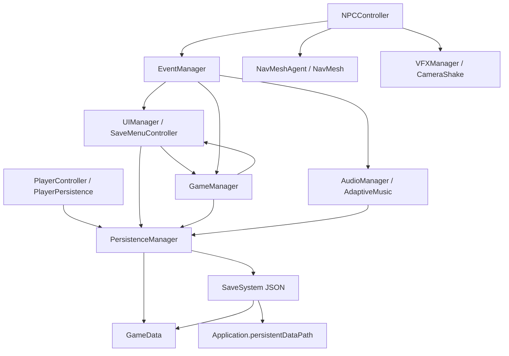

# Diagrama de arquitectura

Este esquema resume como se comunican los sistemas principales del juego.

## Explicacion

- `GameManager` controla el estado global: Playing, Paused, GameOver y Victory.
- `EventManager` desacopla eventos importantes: muerte del jugador, victoria y deteccion del jugador.
- `NPCController` usa `NavMeshAgent` para moverse y raycasts para detectar al jugador. Cuando detecta, avisa mediante eventos.
- `AdaptiveMusic` escucha la deteccion del jugador para cambiar entre musica de exploracion y tension.
- `PersistenceManager` coordina todos los objetos que implementan `IDataPersistence`.
- `SaveSystem` serializa `GameData` a JSON y lo guarda en `Application.persistentDataPath`.
- `UIManager` y `SaveMenuController` conectan botones de pausa, continuar, guardar, cargar, reiniciar y salir.
- `VFXManager` centraliza particulas de alerta, polvo o impacto para que los sistemas no dependan directamente de prefabs concretos.

## Flujo de guardado

1. El jugador pulsa guardar en la UI.
2. `SaveMenuController` llama a `PersistenceManager.Save()`.
3. `PersistenceManager` busca objetos con `IDataPersistence`.
4. Cada objeto vuelca sus datos actuales en `GameData`.
5. `SaveSystem` convierte `GameData` a JSON y escribe el archivo del slot activo.

## Flujo de deteccion enemiga

1. `NPCController` comprueba proximidad y raycast hacia el jugador.
2. Si hay deteccion, cambia a estado `Chase`.
3. Se lanza `EventManager.TriggerPlayerDetected(true)`.
4. La musica adaptativa pasa a tension y el VFX de alerta puede aparecer.
5. Si el NPC alcanza al jugador, se lanza `EventManager.TriggerPlayerDeath()`.
6. `GameManager` cambia a `GameOver` y reinicia la escena.
